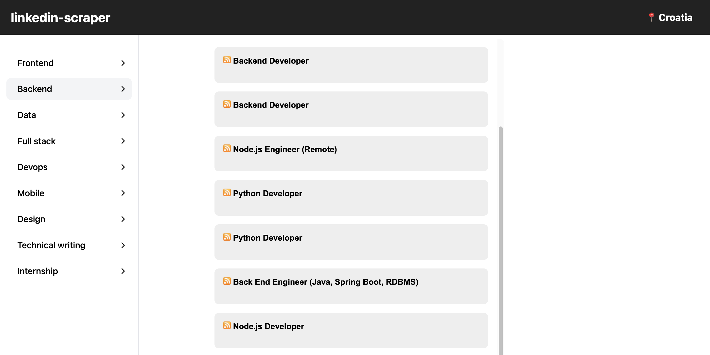

# linkedin-scraper

PHP web application designed to automate the process of collecting job postings from LinkedIn within the IT industry departments in Croatia. The application scrapes data by targeting URLs embedded with query parameters to list the corresponding job postings.

### Query parameters

**`keywords`**: Indicates a department or a position.

Value: `frontend`, `backend`, `data`, `full%20stack`, `devops`, `mobile%20developer`, `design`, `technical%20writing`, `internship`

**`location`**: Indicates location.

Value: `Croatia`

**`refresh`**: Indicates a request to reload the content.

Value: `true`

### Departments

**Frontend**

`?keywords=frontend&location=Croatia&refresh=true`

**Backend**

`?keywords=backend&location=Croatia&refresh=true`

**Data**

`?keywords=data&location=Croatia&refresh=true`

**Full stack**

`?keywords=full%20stack&location=Croatia&refresh=true`

**DevOps**

`?keywords=devops&location=Croatia&refresh=true`

**Mobile**

`?keywords=mobile%20developer&location=Croatia&refresh=true`

**Design**

`?keywords=design&location=Croatia&refresh=true`

**Technical writing**

`?keywords=technical%20writing&location=Croatia&refresh=true`

**Internship**

`?keywords=internship&location=Croatia&refresh=true`
