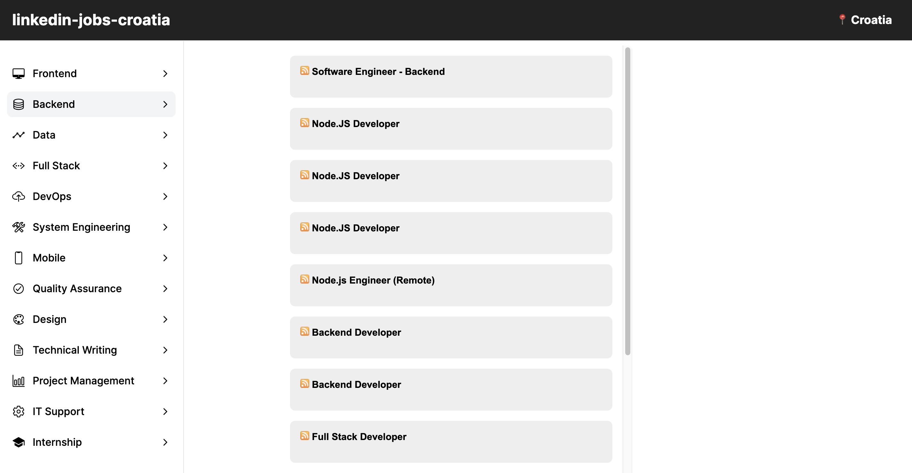

# linkedin-scraper

 

**[Open Application](https://linkedin-scraper-web.vercel.app/)**

 

PHP web application designed to automate viewing job postings from LinkedIn within the IT industry departments in Croatia. The application displays data by utilizing a [scraper widget](https://github.com/stefanicjuraj/scraper-widget) to target URLs embedded with query parameters to display the corresponding job postings.

**GET**: `https://www.linkedin.com/jobs/search/{?keywords}{&location}{&refresh}`

- **URL**: `https://www.linkedin.com/jobs/search/`

- **Keywords**: `frontend`, `backend`, `data`, `full%20stack`, `devops`, `mobile%20developer`, `qa`, `design`, `technical%20writing`, `project%20management`, `internship`

- **Location**: `Croatia`

- **Refresh**: `true`

**Example**: `https://www.linkedin.com/jobs/search/?keywords=backend&location=Croatia&refresh=true`

### Departments

- **Frontend**

- **Backend**

- **Data**

- **Full stack**

- **DevOps**

- **Mobile**

- **Quality Assurance**

- **Design**

- **Technical writing**

- **Project Management**

- **Internship**
